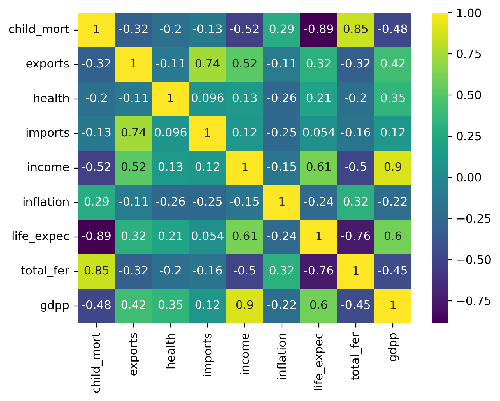

# **Análisis y Segmentación de Datos de Países**

### **Descripción del Proyecto**
Este proyecto analiza datos de países con técnicas de preprocesamiento, análisis exploratorio y segmentación. Los objetivos principales son:
1. Limpiar y estandarizar datos financieros y demográficos.
2. Analizar correlaciones entre variables clave.
3. Aplicar algoritmos de segmentación para identificar patrones y grupos dentro de los datos.

Incluye la implementación de modelos de clustering con hiperparámetros optimizados mediante técnicas bayesianas.

---

### **Características Clave**
1. **Preprocesamiento y Estandarización**:
   - Limpieza de datos: Eliminación de valores nulos y duplicados.
   - Estandarización de variables numéricas para mejorar el desempeño de los modelos.
   - Análisis de correlación con mapas de calor.

2. **Optimización de Modelos**:
   - Implementación de múltiples algoritmos de clustering, como K-Means, DBSCAN, HDBSCAN y otros.
   - Optimización bayesiana de hiperparámetros usando `Optuna`.

3. **Visualización de Resultados**:
   - Mapas de calor para identificar correlaciones significativas.
   - Visualización de los clusters formados por los modelos de segmentación.

---

### **Tecnologías Utilizadas**
- **Python**: Lenguaje principal para análisis y modelado.
- **Scikit-learn**: Implementación de algoritmos de clustering.
- **Pandas y NumPy**: Manipulación y análisis de datos.
- **Matplotlib y Seaborn**: Visualización de datos y mapas de calor.
- **Optuna**: Optimización de hiperparámetros.

---

### **Estructura del Proyecto**
```plaintext
project/
│
├── src/                          # Código fuente
├── datos/                        # Datos de entrada y resultados procesados
│   ├── countries-clean.csv       # Datos depurados y estandarizados
│   └── Country-data.csv          # Datos originales
├── imagenes/                     # Imágenes generadas durante el análisis
│   └── 1_correlacion.png         # Gráfica de correlación
├── README.md                     # Documentación del proyecto
└── requirements.txt              # Dependencias del proyecto
```

---

### **Cómo Empezar**
#### **1. Requisitos Previos**
Asegúrate de tener instalados los siguientes componentes:
- Python 3.8 o superior.
- Librerías necesarias: `scikit-learn`, `optuna`, `numpy`, `pandas`, `matplotlib`, `seaborn`.

Instala las dependencias con:
```bash
pip install -r requirements.txt
```

#### **2. Ejecución del Proyecto**
1. Limpieza y análisis de datos:
   ```bash
   python data_cleaning.py
   ```
2. Optimización y segmentación:
   ```bash
   python clustering.py
   ```

---

### **Ejemplos de Visualización**
#### **Matriz de Correlación**:


---

### **Métricas de Evaluación**
- **Silhouette Score**: Evaluación de la calidad de los clusters generados.
